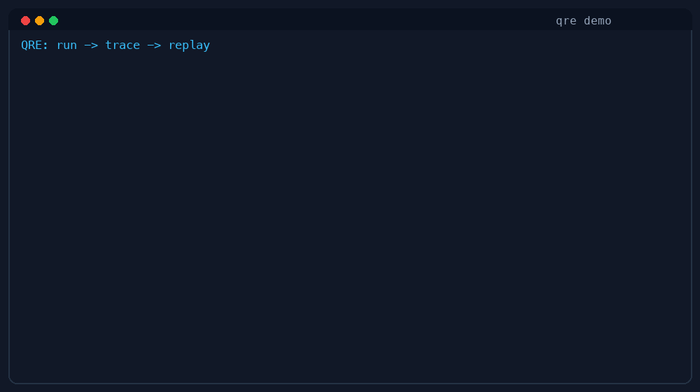

# CodexFlow QueryRuntime

**English** | [简体中文](README.zh-CN.md)

<!-- Badges -->
[](https://github.com/iwaitu/codexflow.queryruntime.engine/actions/workflows/ci.yml)
[](https://github.com/iwaitu/codexflow.queryruntime.engine/actions/workflows/release.yml)
[](LICENSE.txt)

**A cross-platform, auditable, replayable, sandboxed agent runtime — for .NET.**

CodexFlow QueryRuntime is a **runtime harness** for building AI agents. It is *not*
another full coding-assistant app, and it does *not* require a web UI, accounts, a
database, or a SaaS deployment. It extracts the infrastructure that every serious
agent needs — model calls, tool calls, execution policy, trace, replay, sandboxing,
and CLI automation — into a runtime you can **embed, test, extend, and ship as a
single native binary**.

> The implementation is still early/experimental, but already ships a working slice
> you can run today. This is a standalone repository split out from the original
> `codexflow` repo, focused only on the QueryRuntime suite.

<!--
  Demo GIF goes here once recorded, e.g.:
  
-->

## Why it exists

Most agent projects get stuck in the same place: the demo is easy, but turning it
into testable, auditable, reproducible, safely-executable engineering infrastructure
is hard. Common pain points:

- LLM providers differ wildly — tool calls, JSON schema, and "thinking" mode behave
  inconsistently across them.
- Tool execution has no boundary — reading files, writing files, running commands,
  and network access all get tangled together.
- When an agent run fails, there's no reproducible context — you're left guessing
  from terminal logs.
- CLI automation and an in-app embedded runtime end up as two separate codebases.
- The line between local execution, a Docker sandbox, and a Kubernetes runner is
  fuzzy.
- Native AOT publishing, a cross-platform CLI, and plugin loading are in natural
  tension.

QueryRuntime is the layer in between: more engineered than a 50-line agent demo,
lighter than a full SaaS platform. Use it as the foundation for your own agent
product, or just use the `qre` CLI as a tool for CI, codebase analysis, tool-call
validation, and replay debugging.

## Features

- **Unified query/tool loop** — collapses scattered round loops, tool execution, and
  termination logic into one reusable state machine (`IQueryRuntimeEngine`).
- **Read-only tool pack** — `qre_list_files`, `qre_read_file`, `qre_search_files`
  for analysis-style work.
- **Verify tool pack** — `qre_git_status`, `qre_git_diff`, `qre_dotnet_build`,
  `qre_dotnet_test`, executed under a capability policy in a trusted-local context.
- **Trace / replay** — every run writes a JSONL trace; `replay latest` defaults to a
  provider-free / tool-free recorded replay.
- **Run artifacts** — each run writes `events.jsonl`, `manifest.json`, `run.json`,
  `diff.patch`, `usage.json`, and `artifacts/` under `.qre/runs/<run-id>/`. Large
  payloads spill to `blobs/sha256/...`, keeping only digest metadata in the trace.
- **Capability policy** — the `profile` (`none` / `readonly` / `verify`) decides
  which capabilities, commands, network, and mounts are allowed.
- **Sandbox runners** — `LocalProcessSandboxRunner` (trusted local dev) and
  `DockerSandboxRunner` (container isolation: read-only mount, network deny,
  non-root, dropped capabilities, seccomp, and more).
- **External tool manifests** — declare `stdio` or minimal `mcp-stdio` tools via
  `.qre/tools/*.json`, using an out-of-process, manifest-first design compatible
  with Native AOT.
- **Machine-readable output** — `--json` CLI output, `qre trace latest --jsonl`,
  and `qre replay latest` for scripts, CI, and third-party integration.
- **Thinking policy** — thinking is disabled by default when tools or JSON output
  are requested, improving tool-call and schema-output compatibility.
- **Native AOT** — `qre` ships as a single native binary (validated on `osx-arm64`).

## Project layout

Runtime projects:

- `CodexFlow.QueryRuntime.Engine` — the unified query/tool loop execution engine.
- `CodexFlow.QueryRuntime.Abstractions` — Phase 1 stable contracts (runtime, model,
  tool registry, trace store, sandbox runner, CLI option DTOs).
- `CodexFlow.QueryRuntime.Experimental` — a lightweight wrapper and experimental harness.
- `CodexFlow.QueryRuntime.Cli` — the experimental `qre` CLI (main entry point).
- `CodexFlow.QueryRuntime.Sandbox.LocalProcess` — trusted-local `ISandboxRunner`.
- `CodexFlow.QueryRuntime.Sandbox.Docker` — Docker container isolation runner.

Test projects:

- `CodexFlow.QueryRuntime.UnitTests`
- `CodexFlow.QueryRuntime.IntegrationTests`

This repo intentionally does **not** include `CodexFlow.Core`. Core-side bridge
coverage belongs in the original CodexFlow repo, with Core consuming QueryRuntime
through adapters.

## Install

### Option 1: Download a prebuilt binary (recommended)

Grab the single-file `qre` binary for your platform from
[GitHub Releases](https://github.com/iwaitu/codexflow.queryruntime.engine/releases) —
no .NET SDK required:

```bash
# macOS (arm64) example
curl -L -o qre.tar.gz \
  https://github.com/iwaitu/codexflow.queryruntime.engine/releases/latest/download/qre-osx-arm64.tar.gz
tar -xzf qre.tar.gz
chmod +x qre
./qre --version
```

Supported targets: `osx-arm64`, `osx-x64`, `linux-x64`, `linux-arm64`, `win-x64`.

### Option 2: Build from source

```bash
dotnet build CodexFlow.QueryRuntime.slnx
dotnet run --project CodexFlow.QueryRuntime.Cli -- --version
```

Local Native AOT publish:

```bash
dotnet publish CodexFlow.QueryRuntime.Cli -c Release -r osx-arm64 \
  -p:PublishAot=true -p:SelfContained=true
export PATH="$PWD/CodexFlow.QueryRuntime.Cli/bin/Release/net10.0/osx-arm64/publish:$PATH"
qre --version
```

## Quickstart

### 1. Offline smoke (no LLM key needed)

Verify the CLI / trace / JSON output works end to end:

```bash
qre run --workspace . --response "offline smoke" --json "analyze this repo"
```

Emits a single `qre.run.completed` JSON object:

```json
{"type":"qre.run.completed","finalText":"offline smoke","runId":"20260602145703992","termination":"NoToolCalls","profile":"none","tools":[],"traceFilePath":"./.qre/runs/20260602145703992/events.jsonl","totalRounds":1,"totalToolCalls":0,"totalDurationMs":52}
```

### 2. Read-only codebase analysis

```bash
qre run --workspace . --profile readonly --max-rounds 3 \
  "Find the most important runtime entry points and explain them."
```

### 3. Inspect the trace and replay it

```bash
qre trace latest --workspace . --jsonl
qre replay latest --workspace . --json
```

`replay latest` defaults to a recorded replay: it reads the recorded model responses
and tool results from the trace — it does **not** call the provider or re-execute the
original tools.

## Calling a real LLM provider

> **Risk:** with a real provider, your prompt, the model context, and the file
> contents read by tools are sent to the endpoint you configure. Do not run real
> LLM analysis against sensitive private repos before evaluating the provider/proxy
> data policy.

### Via environment variables

```bash
export QRE_API_URL="https://your-provider.example/v1"
export QRE_API_KEY="sk-..."
export QRE_MODEL="your-model"
export QRE_API_MODE="chat-completions"   # or responses / anthropic-messages

qre run --workspace . --profile readonly \
  "Summarize the repository architecture and list the top 3 risks."
```

### Via command-line flags (equivalent)

```bash
qre run --workspace . \
  --api-url "https://your-provider.example/v1" \
  --api-key "$QRE_API_KEY" \
  --model "your-model" \
  --api-mode "chat-completions" \
  --profile readonly \
  "Summarize the repository architecture."
```

### OpenAI-compatible endpoint (DashScope example)

```bash
export QRE_API_URL="https://dashscope.aliyuncs.com/compatible-mode/v1"
export QRE_API_KEY="sk-..."
export QRE_MODEL="deepseek-v4-pro"
export QRE_API_MODE="chat-completions"

qre run --workspace . --profile none --thinking off --json \
  "Output exactly this text and nothing else: OPENAI_COMPAT_OK"
```

### Anthropic Messages-compatible endpoint

```bash
export QRE_API_URL="https://your-anthropic-compatible.example"
export QRE_API_KEY="sk-..."
export QRE_MODEL="your-claude-style-model"
export QRE_API_MODE="anthropic-messages"

qre run --workspace . --profile readonly --thinking off \
  "Explain the module boundaries of this repository."
```

`--api-mode` selects the provider factory's call style. Common values:

- `chat-completions`
- `responses`
- `anthropic-messages`

> The CLI's real-provider path builds clients via `QreVllmChatClientFactory`, which
> recognizes model families (Qwen, OpenAI GPT, Gemini, Claude, Kimi, MiniMax, GLM,
> DeepSeek, …) from the model name. Unknown models currently fall back to a default
> client rather than a strict provider-neutral adapter.

### Calling `qre` from a .NET app

See [examples/RepoDoctor](examples/RepoDoctor) for a full, cross-platform example:
it invokes `qre` as a local agent-runtime CLI, parses the `--json` output, and then
follows up with a replay.

```bash
cd examples/RepoDoctor
dotnet run -- /path/to/repo
```

## Verify tools and capability policy

The `verify` profile adds controlled local command execution on top of the
read-only tools:

```bash
qre run --workspace . --profile verify --max-rounds 4 \
  "Run the focused QueryRuntime tests and summarize failures."
```

Query the policy decision without executing the tool:

```bash
qre policy check --workspace . --profile verify \
  --tool qre_dotnet_test --json \
  -- dotnet test CodexFlow.QueryRuntime.slnx --no-restore
```

Run a policy-gated trusted-local command:

```bash
qre sandbox exec --workspace . --profile verify --json -- git status --short
```

> The `verify` profile is still trusted local execution, not OS-level isolation.
> `LocalProcessSandboxRunner` does not actually block a child process from reaching
> the network or writing files — that requires a Docker/Kubernetes/VM runner to
> become a trusted execution boundary.

## Test

```bash
dotnet test CodexFlow.QueryRuntime.UnitTests/CodexFlow.QueryRuntime.UnitTests.csproj
```

Docker sandbox integration tests are gated (require a local Docker daemon):

```bash
RUN_QUERY_RUNTIME_DOCKER_TESTS=true dotnet test \
  CodexFlow.QueryRuntime.IntegrationTests/CodexFlow.QueryRuntime.IntegrationTests.csproj \
  --filter "FullyQualifiedName~DockerSandboxRunnerIntegrationTests"
```

Gated real-provider integration tests:

```bash
RUN_QUERY_RUNTIME_REAL_INTEGRATION_TESTS=true dotnet test \
  CodexFlow.QueryRuntime.IntegrationTests/CodexFlow.QueryRuntime.IntegrationTests.csproj \
  --filter "FullyQualifiedName~ExperimentalHarnessRealLlmPhaseTests"
```

## Use cases

- **Local codebase analysis** — let a model read repo structure, search files, and
  summarize architecture risks or migration suggestions.
- **Agent tool-call validation** — record model requests, responses, tool requests,
  and tool results as a single JSONL trace for regression testing.
- **Read-only review in CI** — `--json` output is script-consumable, ideal for
  offline smokes and read-only review.
- **Teaching, evaluation, and replay** — replay a provider-free / tool-free decision
  trajectory.
- **A cross-platform agent product foundation** — embed it in desktop apps, IDE
  plugins, CLIs, web backends, or enterprise platforms.

## Security note

`.qre/runs/<run-id>/events.jsonl` can contain prompts, model responses, tool
arguments, tool results, and the contents of files that were read (potentially
private code or secret-shaped strings). The repo `.gitignore` already ignores
`.qre/`. Add the same rule when dogfooding QueryRuntime in other repos, and redact
before uploading `.qre/` as a CI artifact.

## Current limitations

This is a runtime harness still being refined — not yet a mature, secure execution
platform:

- The CLI provider path still relies on `QreVllmChatClientFactory`'s model-family
  heuristic routing, not a fully provider-neutral adapter.
- Replay supports recorded replay, but is not yet benchmark-grade deterministic
  replay (deterministic IDs, clock injection, and cross-version trace migration are
  still hardening items).
- The sandbox has a Docker runner, but Kubernetes / remote runners and a broader
  platform matrix are not done.
- Native AOT is validated locally on `osx-arm64`; Linux/Windows publish, signing,
  release packaging, and the CI matrix are being filled in (see
  [`.github/workflows/release.yml`](.github/workflows/release.yml)).
- `usage.json` is an *estimate* (`ceil(chars / 4.0)`), not a billing source of truth.
- `mcp-stdio` currently supports only a one-shot `tools/call`, without a full
  initialize lifecycle.

## Documentation

- [docs/queryruntime-technical-guide.md](docs/queryruntime-technical-guide.md) — technical guide (positioning, architecture, usage, roadmap).
- [docs/IQueryRuntimeEngine.md](docs/IQueryRuntimeEngine.md) — unified execution engine design.
- [docs/queryruntime-harness-open-source-strategy.md](docs/queryruntime-harness-open-source-strategy.md) — open-source harness strategy.
- [docs/queryruntime-next-development-plan.md](docs/queryruntime-next-development-plan.md) — development plan ([中文](docs/queryruntime-next-development-plan.zh-CN.md)).
- [docs/queryruntime-tool-partition-matrix.md](docs/queryruntime-tool-partition-matrix.md) — tool partition matrix.
- [docs/tool-capabilities.md](docs/tool-capabilities.md), [docs/threat-model.md](docs/threat-model.md).

## License

[MIT](LICENSE.txt)

## In one sentence

CodexFlow QueryRuntime aims to be a cross-platform, auditable, replayable,
sandboxable, embeddable agent runtime harness — making it easier to build your own
coding agent, CI agent, IDE agent, or internal enterprise agent platform, instead of
forcing you to adopt a full SaaS app.
