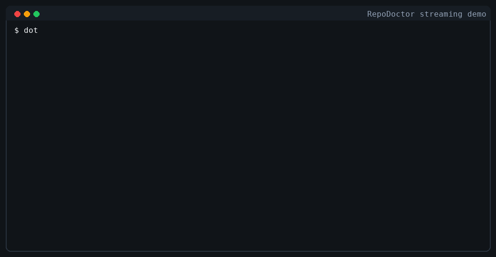
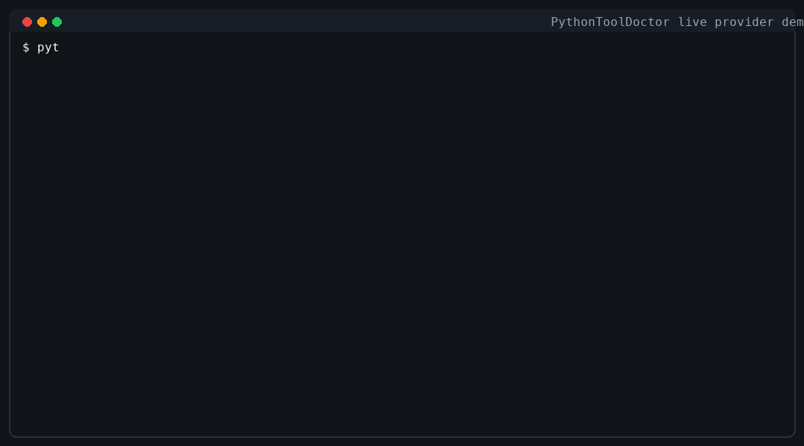
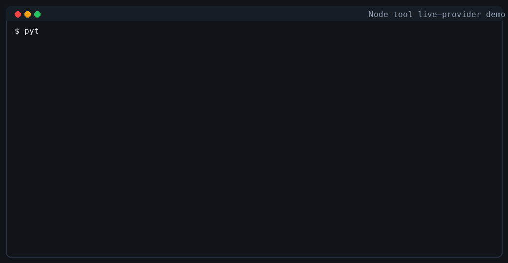

# CodexFlow QueryRuntime

**简体中文** | [English](README.md)

CodexFlow QueryRuntime 是一个面向 Agent 开发的 **runtime harness**（运行时底座）。
它不是又一个完整的 AI 编程应用，也不是一套必须绑定 Web UI、账号系统、数据库
和 SaaS 部署形态的平台。它的核心目标是把“模型调用、工具调用、执行策略、
trace、replay、sandbox、CLI 自动化”这些 Agent 基础设施抽出来，形成一个
**可嵌入、可测试、可扩展、可跨平台发布**的运行时。

> 当前实现仍处于实验阶段，但已经具备一个可以验证方向的最小切片。本仓库是从
> 原始 `codexflow` 仓库拆分出的独立仓库，专注于 QueryRuntime 套件。

## 它解决什么问题

很多 Agent 项目都会卡在同一个位置：demo 很容易写，但要变成可测试、可审计、
可复现、可安全运行的工程基础设施很难。典型问题包括：

- LLM provider 差异大，工具调用、JSON schema、thinking 模式行为不一致。
- 工具执行缺少边界，读文件、写文件、跑命令、访问网络经常混在一起。
- Agent 运行失败后缺少可复现上下文，只能看终端日志猜测。
- CLI 自动化和应用内嵌 runtime 往往是两套逻辑，难以共享。
- 本地执行、Docker sandbox、Kubernetes runner 的抽象边界不清晰。
- Native AOT 发布、跨平台 CLI、插件加载之间存在天然张力。

QueryRuntime 提供一个中间层：比“几十行 Agent demo”更工程化，又比完整 SaaS
平台更轻。开发者可以把它作为自己 Agent 产品的底座，也可以只把 `qre` CLI 当作
CI、代码库分析、工具执行验证和 replay 调试工具来用。

## 核心能力

- **统一 Query/Tool Loop**：把分散的 round loop、工具执行与终止判断收口为一个
  可复用的状态机（`IQueryRuntimeEngine`）。
- **只读工具包**：`qre_list_files`、`qre_read_file`、`qre_search_files`，适合
  分析型任务。
- **verify 工具包**：`qre_git_status`、`qre_git_diff`、`qre_dotnet_build`、
  `qre_dotnet_test`，在 trusted-local 环境下经 capability policy 受控执行。
- **Trace / Replay**：每次运行写入 JSONL trace；默认公开投影会脱敏宿主运行/查询标识且仅可查看摘要。
  只有经过审查的合成 fixture 才显式使用 `--trace-data sanitized`。`--trace-data private`
  写入独立 owner-only 目录，默认保留 7 天、最长 30 天，随后才能执行 provider-free / tool-free replay。
- **Run artifacts**：公开/合成运行在 `.qre/runs/<persisted-id>/` 写入 `events.jsonl`、
  `manifest.json`、`run.json`、`diff.patch`、`usage.json` 与 `artifacts/`；
  private 运行写入 `.qre/private/runs/<private-id>/`。大 payload 落到 `blobs/sha256/...`，
  trace 中只保留 digest metadata。
- **Capability policy**：`profile`（`none` / `readonly` / `verify`）决定允许哪些
  capability、命令、网络与挂载行为。
- **Sandbox runner**：`LocalProcessSandboxRunner`（可信本地开发）与
  `DockerSandboxRunner`（容器隔离，read-only mount、network deny、non-root、
  drop capabilities、seccomp 等）。
- **外部工具 manifest**：`.qre/tools/*.json` 可声明 `stdio` 或最小 `mcp-stdio`
  工具，采用 out-of-process、manifest-first 设计，兼容 Native AOT 路径。
- **延迟工具激活**：可启用 `tool_search`，让模型从很小的 always-on 工具面开始，
  按能力搜索并在后续轮次激活 deferred 工具。
- **Python function tools**：Python 项目可以给普通函数加装饰器，生成 manifest，
  再注册成 QRE tools；LLM tool-call loop 仍由 QRE 接管。
- **机器可读输出**：`--json` CLI 输出、`qre trace latest --jsonl`、
  `qre replay latest`，便于脚本、CI 与第三方应用集成。
- **Thinking 策略**：启用工具或要求 JSON 输出时默认关闭 thinking，提升工具调用
  与 schema 输出兼容性。
- **Native AOT**：`qre` 已在本地 `osx-arm64` 通过 Native AOT publish 与 smoke。

## 项目结构

运行时项目：

- `CodexFlow.QueryRuntime.Engine` — 统一 Query/Tool Loop 执行引擎。
- `CodexFlow.QueryRuntime.Abstractions` — Phase 1 稳定 contract（runtime、model、
  tool registry、trace store、sandbox runner、CLI option DTO）。
- `CodexFlow.QueryRuntime.Experimental` — 对现有引擎的轻量封装与实验 harness。
- `CodexFlow.QueryRuntime.Cli` — 实验性 `qre` CLI（主入口）。
- `CodexFlow.QueryRuntime.Sandbox.LocalProcess` — trusted-local `ISandboxRunner`。
- `CodexFlow.QueryRuntime.Sandbox.Docker` — Docker 容器隔离 runner。

测试项目：

- `CodexFlow.QueryRuntime.UnitTests`
- `CodexFlow.QueryRuntime.IntegrationTests`

本仓库刻意不包含 `CodexFlow.Core`。Core 侧的 bridge 覆盖属于原始 CodexFlow
仓库，由 Core 通过 adapter 消费 QueryRuntime。

## 作为 .NET 类库嵌入

当另一个 .NET 应用需要让 QRE 替代现有 in-process runtime 时，应使用
`CodexFlow.QueryRuntime.Abstractions.IQueryRuntimeHostEngine`。这个 contract
可以接收多轮 `ChatMessage` 历史、自定义 `AIFunction` 工具、required-tool
控制、provider `ChatOptions`、trace/workspace 路径，以及流式文本回调。CLI
可以保持较小；host facade 才是完整替代旧 runtime 的类库入口。

启用 `ToolSearch` 时，即使宿主传入的是 `InitialMessages`，QRE 也会在最前面
插入一条很小的 discovery system message，包含 `tool_search` 用法和 deferred
tools 目录；宿主原始消息保持不变。若同时设置 `RequiredToolName`，该 required
tool 会在首轮保持可见，避免 provider 收到“要求调用但未声明 schema”的工具模式。

```csharp
using CodexFlow.QueryRuntime.Experimental;
using Microsoft.Extensions.AI;
using Qre = CodexFlow.QueryRuntime.Abstractions;

Qre.IQueryRuntimeHostEngine runtime =
    new ExperimentalQueryRuntimeHarness(
        new ChatClientExperimentalModelClient(chatClient));

var result = await runtime.RunAsync(
    new Qre.QueryRuntimeHostRequest
    {
        InitialMessages = history,
        WorkspacePath = workspacePath,
        RunId = runId,
        SessionId = sessionId,
        Tools = customTools,
        RequiredToolName = "repo_context",
        Execution = new Qre.QueryRuntimeExecutionOptions { MaxRounds = 4 },
        ToolSearch = new Qre.QueryRuntimeToolSearchOptions { Enabled = true, TopK = 3 },
        Trace = new Qre.QueryRuntimeTraceOptions
        {
            DataMode = Qre.QueryRuntimeTraceDataMode.PublicRedacted
        },
        Options = chatOptions,
        TextDeltaSink = (delta, ct) => StreamToClientAsync(delta, ct)
    },
    ct);
```

完整 engine 与 facade contract 见
[docs/IQueryRuntimeEngine.zh-CN.md](docs/IQueryRuntimeEngine.zh-CN.md)。延迟工具激活设计见
[docs/toolsearch.md](docs/toolsearch.md)。

## 安装

### 方式一：下载预编译二进制（推荐）

从 [GitHub Releases](https://github.com/iwaitu/codexflow.queryruntime.engine/releases)
下载对应平台的 `qre` 单文件二进制，无需安装 .NET SDK：

```bash
# macOS (arm64) 示例
curl -L -o qre.tar.gz \
  https://github.com/iwaitu/codexflow.queryruntime.engine/releases/latest/download/qre-osx-arm64.tar.gz
tar -xzf qre.tar.gz
chmod +x qre
./qre --version
```

支持的平台：`osx-arm64`、`osx-x64`、`linux-x64`、`linux-arm64`、`win-x64`。

### 方式二：从源码构建

```bash
dotnet build CodexFlow.QueryRuntime.slnx
dotnet run --project CodexFlow.QueryRuntime.Cli -- --version
```

本地 Native AOT publish：

```bash
dotnet publish CodexFlow.QueryRuntime.Cli -c Release -r osx-arm64 \
  -p:PublishAot=true -p:SelfContained=true
export PATH="$PWD/CodexFlow.QueryRuntime.Cli/bin/Release/net10.0/osx-arm64/publish:$PATH"
qre --version
```

### 方式三：构建 NuGet 类库包

QRE 的 NuGet 输出是核心 Engine 包；该包会内置 host-facing Abstractions
assembly，因此 downstream 只需要安装 `CodexFlow.QueryRuntime.Engine`。`qre`
CLI 默认通过 native release artifacts 分发，不打包成 .NET tool 包。

```bash
scripts/qre-pack-nuget.sh Release
```

包会输出到 `artifacts/nuget`：

- `CodexFlow.QueryRuntime.Engine`

可以用 `QRE_PACKAGE_VERSION` 覆盖版本号：

```bash
QRE_PACKAGE_VERSION=0.1.2 scripts/qre-pack-nuget.sh Release
```

## 快速开始

### 1. 离线 smoke（无需任何 LLM key）

验证 CLI / trace / JSON 输出是否正常：

```bash
qre run --workspace . --response "offline smoke" --json "analyze this repo"
```

显式验证路线二 C6 的 v2 Hosting facade、确定性 context、延迟冻结工具目录和 versioned audit（preview）：

```bash
qre run --runtime v2 --workspace . --profile readonly --tool-search \
  --trace-data sanitized --response "offline v2 smoke" --json "exercise v2"
qre replay latest --runtime v2 --workspace . --strict --json
```

未传 `--runtime v2` 时继续使用 v1。C6 v2 已支持 none/readonly/verify/repair 与 external stdio
工具；写入和高风险执行需要 `--approve-risk <reason>`，审批绑定规范化参数、workspace、policy、
sandbox 与有效期。`--tool-search` 现在以冻结执行目录的逐 Step 子集工作：首轮只暴露
`tool_search`，激活后的 schema 从下一 Step 开始可见。v2 默认审计是
`PublicRedacted / SummaryOnly`；只有显式 `sanitized/private` 数据可 recorded replay，回放不调用 provider、
不执行工具。

输出一条 `qre.run.completed` JSON：

```json
{"type":"qre.run.completed","finalText":"offline smoke","runId":"20260602145703992","termination":"NoToolCalls","profile":"none","tools":[],"traceFilePath":"./.qre/runs/20260602145703992/events.jsonl","totalRounds":1,"totalToolCalls":0,"totalDurationMs":52}
```

### 2. 只读代码库分析

```bash
qre run --workspace . --profile readonly --max-rounds 3 \
  "Find the most important runtime entry points and explain them."
```

如果希望缩小首轮工具 schema，可启用延迟工具激活：

```bash
qre run --workspace . --profile readonly --tool-search --tool-search-top-k 3 \
  "Find the files that define the runtime engine."
```

启用 `--tool-search` 后，首轮模型只看到 `tool_search`。搜索结果会返回 score、
风险、命中字段、必填/可选参数和激活状态；被激活的工具会在后续轮次注入。

### 3. 查看 trace 与 replay

```bash
qre trace latest --workspace . --jsonl
qre replay latest --workspace . --json
qre replay latest --runtime v2 --workspace . --summary --json
```

`replay latest` 默认走 recorded replay：从 trace 读取已记录的模型响应与工具结果，
不调用 provider、不执行原始工具。

## 真实 LLM provider 调用

> **风险**：使用真实 provider 时，prompt、模型上下文以及工具读取到的文件内容
> 会发送到你配置的 endpoint。请勿在未评估 provider / proxy 数据策略前，对敏感
> 私有仓库运行真实 LLM 分析。

### 通过环境变量配置

```bash
export QRE_API_URL="https://your-provider.example/v1"
export QRE_API_KEY="sk-..."
export QRE_MODEL="your-model"
export QRE_API_MODE="chat-completions"   # 或 responses / anthropic-messages

qre run --workspace . --profile readonly \
  "Summarize the repository architecture and list the top 3 risks."
```

### 等价的命令行参数

```bash
qre run --workspace . \
  --api-url "https://your-provider.example/v1" \
  --api-key "$QRE_API_KEY" \
  --model "your-model" \
  --api-mode "chat-completions" \
  --profile readonly \
  "Summarize the repository architecture."
```

### OpenAI 兼容 endpoint（DashScope 示例）

```bash
export QRE_API_URL="https://dashscope.aliyuncs.com/compatible-mode/v1"
export QRE_API_KEY="sk-..."
export QRE_MODEL="deepseek-v4-pro"
export QRE_API_MODE="chat-completions"

qre run --workspace . --profile none --thinking off --json \
  "只输出以下固定文本，不要添加任何其它字符：OPENAI_COMPAT_OK"
```

### Anthropic Messages 兼容 endpoint

```bash
export QRE_API_URL="https://your-anthropic-compatible.example"
export QRE_API_KEY="sk-..."
export QRE_MODEL="your-claude-style-model"
export QRE_API_MODE="anthropic-messages"

qre run --workspace . --profile readonly --thinking off \
  "Explain the module boundaries of this repository."
```

`--api-mode` 用于选择 provider factory 的调用风格，常见值：

- `chat-completions`
- `responses`
- `anthropic-messages`

> CLI 真实 provider 路径由 `QreVllmChatClientFactory` 创建 client，会根据 model
> name 识别 Qwen / OpenAI GPT / Gemini / Claude / Kimi / MiniMax / GLM / DeepSeek
> 等模型族；未知模型目前落到默认 client，而不是严格 provider-neutral adapter。

### 在 .NET 应用中以子进程调用

完整示例见 [examples/RepoDoctor](examples/RepoDoctor)：把 `qre` 当作本地 Agent
runtime CLI 调用，注册一个自定义 .NET stdio 工具，通过
`qre tool invoke` 调用该工具，再将真实 provider 的模型回复流式输出到宿主应用
控制台，并跟随做一次 recorded replay。
如果没有设置 `QRE_API_URL` / `QRE_API_KEY` / `QRE_MODEL`，它会默认读取 sibling
CodexFlow appsettings 中的 `VllmAgent` provider 配置。



```bash
cd examples/RepoDoctor
dotnet run -- /path/to/repo
```

使用 `dotnet run -- --offline /path/to/repo` 可以在没有 LLM key 的情况下验证
子进程、streaming、trace 与 replay 路径。offline 模式使用静态模型回复，因此
真正的自定义工具调用验证应使用 live provider 模式。

### Python live-provider 工具调用流式示例

[examples/PythonToolDoctor](examples/PythonToolDoctor) 演示 Python 以子进程方式
调用 `qre`。它默认从 sibling CodexFlow 的 `appsettings.json` 读取 provider
配置，使用真实 LLM provider 流式输出回复，通过 `--required-tool` 强制一次
`qre_list_files` 工具调用，并从 recorded trace 中验证该工具调用确实发生。



```bash
python examples/PythonToolDoctor/doctor.py /path/to/repo
```

### Node.js live-provider 工具示例

[examples/NodeFunctionTools](examples/NodeFunctionTools) 演示如何把 Node.js
函数变成 QRE stdio 工具。录制示例会生成 Node manifest，注册
`node_count_files`，通过 QRE 调用该工具，然后把工具结果交给真实 LLM provider
流式生成回答。



```bash
python scripts/generate-node-tool-demo.py
```

### 注册新工具

QRE 通过 workspace-local manifest 注册新的进程外工具，manifest 放在
`.qre/tools/*.json`。最小 stdio 工具、manifest、发现命令和 `--required-tool`
smoke 示例见 [examples/ExternalTools](examples/ExternalTools)。
Python 项目可参考 [examples/PythonFunctionTools](examples/PythonFunctionTools)，
用 `@qre_tool` 声明普通函数并生成 manifest 后注册。
Node.js 项目可参考 [examples/NodeFunctionTools](examples/NodeFunctionTools)，
用原生 ESM 和显式 JSON schema 走同样的 manifest 生成与注册流程。

```bash
qre tool register --workspace . --manifest examples/ExternalTools/echo_tool.manifest.json
qre tool list --workspace . --profile readonly --external --json
```

```bash
python examples/PythonFunctionTools/repo_tools.py --manifest-dir .qre/generated-tools
qre tool register --workspace . --manifest .qre/generated-tools/py_count_files.json
```

```bash
node examples/NodeFunctionTools/repo_tools.mjs --manifest-dir .qre/generated-tools
qre tool register --workspace . --manifest .qre/generated-tools/node_count_files.json
```

## verify 工具与 capability policy

`verify` profile 在 readonly 工具之外提供受控的本地命令执行：

```bash
qre run --workspace . --profile verify --max-rounds 4 \
  "Run the focused QueryRuntime tests and summarize failures."
```

不执行工具，仅查询 policy decision：

```bash
qre policy check --workspace . --profile verify \
  --tool qre_dotnet_test --json \
  -- dotnet test CodexFlow.QueryRuntime.slnx --no-restore
```

经 policy 限制的 trusted-local 命令执行：

```bash
qre sandbox exec --workspace . --profile verify --json -- git status --short
```

> `verify` profile 当前仍是 trusted local execution，不是 OS 级隔离。
> `LocalProcessSandboxRunner` 不会真的阻断子进程的网络访问或写入；这些需要
> Docker/Kubernetes/VM runner 才能成为可信执行边界。

## 测试

```bash
dotnet test CodexFlow.QueryRuntime.UnitTests/CodexFlow.QueryRuntime.UnitTests.csproj
```

Docker sandbox 集成测试默认 gated（需要本地 Docker daemon）：

```bash
RUN_QUERY_RUNTIME_DOCKER_TESTS=true dotnet test \
  CodexFlow.QueryRuntime.IntegrationTests/CodexFlow.QueryRuntime.IntegrationTests.csproj \
  --filter "FullyQualifiedName~DockerSandboxRunnerIntegrationTests"
```

gated real-provider 集成测试：

```bash
RUN_QUERY_RUNTIME_REAL_INTEGRATION_TESTS=true dotnet test \
  CodexFlow.QueryRuntime.IntegrationTests/CodexFlow.QueryRuntime.IntegrationTests.csproj \
  --filter "FullyQualifiedName~ExperimentalHarnessRealLlmPhaseTests"
```

## 适用场景

- **本地代码库分析** — 让模型读取仓库结构、搜索文件、总结架构风险或生成迁移建议。
- **Agent 工具调用验证** — 把模型请求、响应、工具请求、工具结果统一记录为 JSONL
  trace，便于回归测试。
- **CI / 自动化只读审查** — `--json` 输出可被脚本消费，适合离线 smoke 与只读审查。
- **教学、评测与 replay** — 重放一条 provider-free / tool-free 决策轨迹。
- **跨平台 Agent 产品底座** — 被桌面应用、IDE 插件、CLI、Web 后端或企业平台嵌入。

## 安全提示

`.qre/runs/<run-id>/events.jsonl` 可能包含 prompt、模型响应、工具参数、工具结果
以及被读取文件的内容（可能含私有代码或密钥样式字符串）。仓库 `.gitignore` 已忽略
`.qre/`；在其他仓库 dogfood 时请同步忽略，CI 上传前需脱敏。

## 当前限制

这是一个正在提炼中的 runtime harness，尚不应被描述为成熟的安全执行平台：

- CLI provider 路径仍依赖 `QreVllmChatClientFactory` 的模型族启发式路由，不是
  完全 provider-neutral 的通用 adapter。
- replay 已支持 recorded replay，但还不是 benchmark 级 deterministic replay。
- run-scoped `diff.patch` 只按 repair tools 记录的路径收敛范围；但如果同一个文件
  在 run 前已经有未提交修改，patch 表达的是从 `HEAD` 到最终文件状态的完整差异，
  会包含该同文件的 pre-existing delta。
- sandbox 已有 Docker runner，但 Kubernetes / remote runner 与更多平台矩阵未完成。
- Native AOT 已有 blocking `linux-x64` CI lane 和 release packaging workflow；签名
  与 protected-branch required check 仍需在首个 pre-release 前通过仓库设置核验。
- `usage.json` 当前是估算 usage（`ceil(chars / 4.0)`），不能作为计费依据。
- `mcp-stdio` 当前只支持 one-shot `tools/call`，没有完整 initialize lifecycle。

## 文档

- [docs/queryruntime-technical-guide.zh-CN.md](docs/queryruntime-technical-guide.zh-CN.md) — 技术说明（定位、架构、用法、演进路径）。
- [docs/IQueryRuntimeEngine.zh-CN.md](docs/IQueryRuntimeEngine.zh-CN.md) — 统一执行引擎详细设计。
- [docs/toolsearch.md](docs/toolsearch.md) — `tool_search` 延迟工具激活设计。
- [docs/queryruntime-harness-open-source-strategy.md](docs/queryruntime-harness-open-source-strategy.md) — 开源 harness 策略（英文）。
- [docs/queryruntime-pre-release-work-plan.zh-CN.md](docs/queryruntime-pre-release-work-plan.zh-CN.md) — pre-release 工作计划。
- [docs/vnext-core-parity-execution-plan.zh-CN.md](docs/vnext-core-parity-execution-plan.zh-CN.md) — 当前 vNext Core Parity 执行计划。
- [docs/vnext-core-parity-baseline.zh-CN.md](docs/vnext-core-parity-baseline.zh-CN.md) — C0 冻结契约与 3/10/25-step 基线。
- [docs/migration-0.2-preview.zh-CN.md](docs/migration-0.2-preview.zh-CN.md) — v1/v2 API、CLI、宿主与回退迁移指南。
- [docs/archive/queryruntime-next-development-plan.completed-2026-06-04.zh-CN.md](docs/archive/queryruntime-next-development-plan.completed-2026-06-04.zh-CN.md) — 已归档的完成态开发计划。
- [docs/queryruntime-tool-partition-matrix.md](docs/queryruntime-tool-partition-matrix.md) — 工具分区矩阵（英文）。
- [docs/tool-capabilities.md](docs/tool-capabilities.md)、[docs/threat-model.md](docs/threat-model.md)（英文）。

## License

[MIT](LICENSE.txt)

## 一句话总结

CodexFlow QueryRuntime 的方向，是成为一个跨平台、可审计、可 replay、可 sandbox、
可嵌入的 Agent runtime harness——让开发者更容易构建自己的 coding agent、CI agent、
IDE agent 或企业内部 agent 平台，而不是要求他们采用一个完整的 SaaS 应用。
